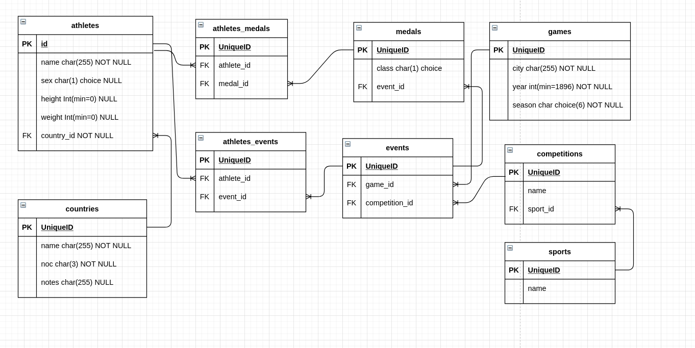
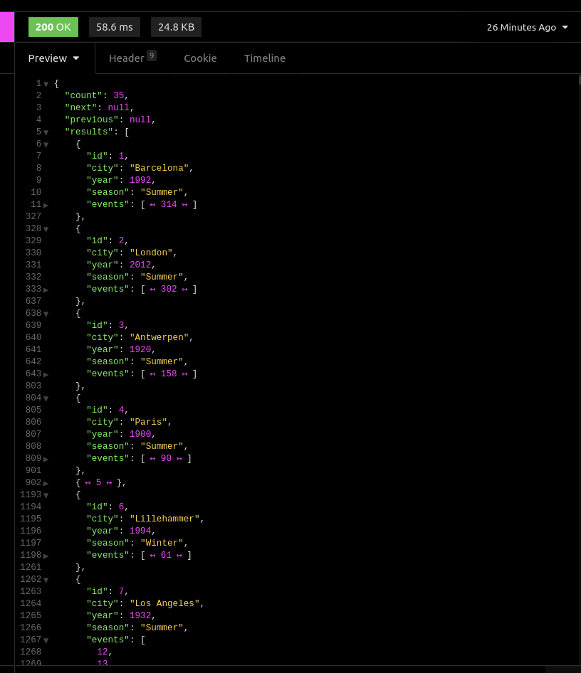
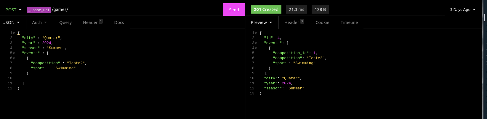

# Sobre
Ester README tem por objetivo fornecer as informações necessárias para instalação e execução de uma API REST, feita com Django e o Django Rest framework, que usa um [Dataset de 120 anos de historia das Olimpíadas](https://www.kaggle.com/heesoo37/120-years-of-olympic-history-athletes-and-results#athlete_events.csv).

[Instancia hospedada na Heroku](https://enias-olympic.herokuapp.com/)

#  Instalação

## Dependências

Esse projeto foi desenvolvido com [Poetry](https://python-poetry.org/), uma alternativa ao Pip para gestão de dependencias. 
 
Dito isso, o arquivo "requirements.txt" dá suporte para o uso do Pip.

### Instalação com Docker

Está disponivel uma configuração para para rodar a aplicação com o docker / docker-compose. Basta ter as duas ferramentas devidamente configuradas e rodar `docker-compose up --build`

Nota se que os comandos seeds vão popular toda vez que subir os containers, recomendo criar um volume e deletar caso for rodar novamente. (O ideial seria colocar uma condição, vou colocar no futuro)

Acessando o `localhost:8000` você terá acesso a API.

### Passo-a-passo para instalação Manual com Pip
*Na linha de comando, usando Bash:*
- 1. Criar um ambiente virtual usando venv : `python -m venv venv`
- 2. Entrar no ambiente virtual: `source venv/bin/activate`
- 3 . Instalar todas as dependencias: `pip install -r requirements.txt`
- 4. Rodar migrations `python manage.py migrate`
- 5. Rodar commando seeds `python manage.py seed_countries data/noc_regions.csv; python manage.py seed_athletes data/athlete_events.csv'`
- 6. Iniciar servidor `python manage.py runserver 0.0.0.0:8000`

### Passo-a-passo para instalação com Poetry

*Na linha de comando, usando Bash:*
- 1. Entrar no ambiente virtual: `poetry shell`
- 2. Instalar todas dependencias: `poetry install`
- Igual ao Pip

## Banco de Dados

Se for rodar localmente, será necessário criar um Banco de dados local sem nenhuma configuração ou tabela e depois rodar as migrations.

A API salva os dados em um banco de dados PostgreSQL para fácil deploy no Heroku.

Também é possivel usar uma versão "Teste", que usa o SQLite, basta adicionar uma variável de ambiente TEST=True

## Diagrama Relacional

Segue a função das tabelas e suas carateristicas 

- Pais e Atletas são representações unicas de cada.
- Jogo (Game) é a repressentaçaõ de um jogo Olimpico, definido por Ano, Cidade e Temporada. 
- Eventos e Competições. Uma competição representa uma modalidade especifica de um esporte. Exemplo, Futebol de Praia, que faz parte do Esporte Futebol. Uma competição pode acontecer em mais de uma olimpiada. Logo uma competição que acontece em uma Olimpiada é um Evento. 
- Medalhas são identificadas por 4 carateristicas, O Jogo Olimpico a qual foi conquistada, a modalidade, classe (Ouro, Prata, Bronze) e o vencedor. Assim, cada medalha está atrelada a um Evento (Jogo e Modalidade especifica) e um ou mais atletas (Jogos coletivos contam como uma medalha mas todos integrantes recebem um)

## Variaveis de ambiente

O arquivo "dev.env" é onde se espera colocar as variáveis de ambiente relacionadas ao Banco PostgreSQL local

## Endpoints

A um arquivo JSON da coleção que usei no insomnia. Recomendo o uso do mesmo para ter acesso aos endpoints que usei com facilidade.

### Games
Games são os jogos Olimpícos. Podem ser lidos individualmente, listados, criados, atualizados e deletados. 

Exemplos GET:
`api/games/`
`api/games/1`
`api/games?year=2012`

Tambem podem ser filtrados por Ano e/ou Cidade atráves dos parametros name e city na url.

Na criação de um Jogo, é possivel criar os eventos que aconteceram.

### Eventos
São modalidades esportivas praticadas em um Jogo Olimpico especifico. São usados como referencias para medalhas e na participação de Atletas nas Olimpíadas.

Para acessar os eventos de um Jogo especifico:
GET`api/games/1/events`

Todo evento é atrelado a um jogo, então é apenas possivel criar um evento no mesmo momento que se cria um Jogo Olimpico novo ou na suburl de um jogo especifico
POST `api/games/1/events`

### Atletas
Atráves dos atletas é possivel ver suas medalhas e participaçãos em eventos de Jogos Olimpicos.

Exemplos:
`api/athletes/`
`api/athletes/1`
`api/athletes?search=Rafael`

Para associar um atleta a um evento ou medalha, é preciso primeiro buscar o id do mesmo e adicionar aos campos na hora de criação ou fazendo uma atualização.

### Medalhas

Medalhas estão diretamente ligadas a um evento, logo para criar uma é preciso de um evento para associar a mesma. Com o id de uma medalha é possivel associar ela para vários atletas.

### Países
Lista de Países e seus NOC, é possivel ter acesso a todas as medalhas / eventos / Jogos atráves de seus atletas, interessante implementar no futuro mas precisa ser implementado da forma correta. 

### Scripts de Seed

Existem 2 Scripts de Seed, o "seed_countries" e "seed_athletes" que devem ser executadas nessa ordem pois o seed_athletes assume que os paises já forma inseridos.(pensado agora, poderia ter colocado tudo em um só kkk, acontece.)

`python manage.py seed_countries ./data/noc_regions.csv`
`python manage.py seed_athletes ./data/athlete_events.csv`

A estrátegia para implementação desses seeds se resume a um principip básico: "É mais fácil ler um arquivo do que escrever."

Assim, busquei tratar ao máximo os dados e fazer o minimo de "inseções" usando o bulk_create, não foi fácil pois ele não é feito para relações Many to Many mas fiz umas adaptações e estou bem statisfeito a implementação. 

Qualquer dúvida, só chamar!
